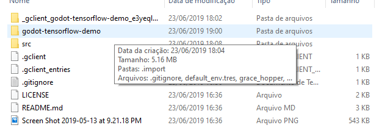
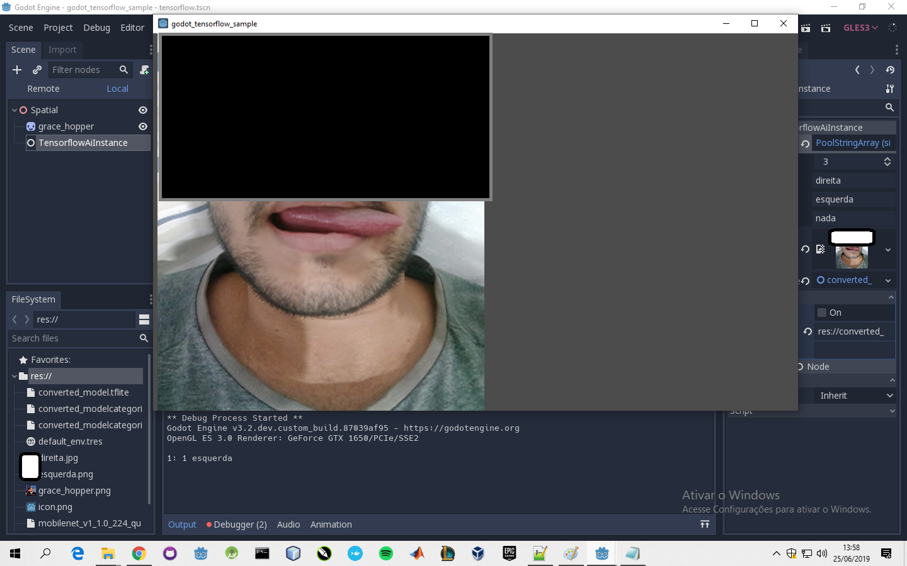
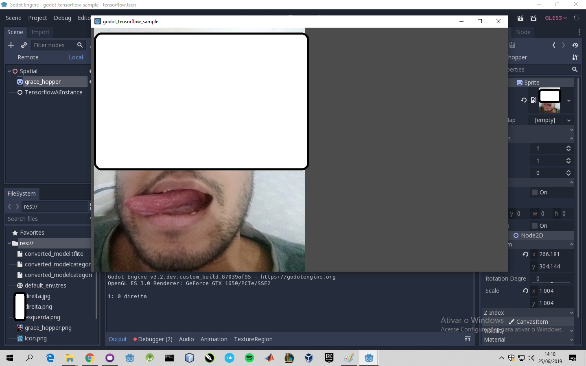

## Tensorflow no Godot ?! 

Recentemente em uma pesquisa no google, a procura de algum plugin para IA no godot, acabei me deparando com um post do [reddit](https://www.reddit.com/r/godot/comments/bobm5e/tensorflow_module_for_godot_engine/) que apresentava um modulo/plugin para o tensorflow.
O godot por ser open source abre margem para a colaboração de vários usuários e graças a isso o usuário [K. S. Ernest (iFire) Lee](https://github.com/fire) desenvolveu esse plugin e com isso irei realizar um tutorial de instalação para o pessoal do LEnDA explorar futuramente esse plugin.

## Instalações 

Esse tutorial é para windows (OBS: tentei para linux mas não conseguir, conversei com o desenvolvedor do plugin ele disse que não tinha testado para linux ainda, apenas para windows). Como sabemos por ser open source o godot oferece um código aberto de sua ferramenta que é possível adicionar plugins e etc, mas para isso é necessário um compilação do godot juntamente com plugin e as ferramentas que deseja. O resultado final dessa compilação é o "exe" do godot.

Links para Estudo:

1- Primeiro instale o python e consequentemente o tensorflow, vale lembrar que o tensorflow utilizado é o tensorflow==2.0.0-beta1. Baixe o [python](https://www.python.org/) versão 3.6 pra cima e a instalação do [Tensorflow](https://www.tensorflow.org/install) basta seguir o passo a passo. Lembre de adicionar o python na sua variável de ambiente. Você também pode seguir a instalação pelo [Anaconda](https://github.com/wstroks/tensorflowLenda), lembrar de deixar o python do Anaconda na sua variável de ambiente, se não estiver, você não conseguirá rodar no CMD.

2- Para compilar o godot será necessário baixar o [Visual Studio](https://visualstudio.microsoft.com/pt-br/thank-you-downloading-visual-studio/?sku=Community&rel=16), marque as opções do windows para c/c++, como na imagem abaixo ( Tambem coloquei a opção do C# para não ter problema na hora de compilar, segurança haha).

3- Será necessário instalar o [SCONS](https://scons.org/pages/download.html) baixe a versão atual em zip, extraia os arquivos vai na pasta que extraiu e digite python setup.py install. 

4- [py32](https://github.com/mhammond/pywin32/releases) é graças a esse pacote que é possivel gerar o exe do godot, antes de instalar verifique sua versão do python. Só ir no cmd e digitar python --version.

5- Ressaltando que será necessário ter o git instalado no seu pc/computador juntamente com o composer.

## Agora Vamos pro plugin;

[Plugin](https://github.com/godot-extended-libraries/godot-tensorflow-workspace) você irá seguir o passo a passo, que está escrito WINDOWS, mas antes terá que criar uma pasta chamada workspace no C:\ e baixar as pastas deep_tols, godot-tensorflow-workspace e [godot-extended-libraries/godot-tensorflow](https://github.com/godot-extended-libraries/godot-tensorflow).

Depois que fazer todo o tutorial ficarar assim as pastas.

Como mostra no tutorial, apos organizar as pastas você irá na pasta godot-tensorflow-workspace e digitar gclient sync no cmd.

Pronto deu tudo certo ??? se não me envie msg no Issues.

## Sucesso

Agora dentro da pasta godot-tensorflow-workspace terá uma pasta chamada src/godot, vah até ela no cmd.
Após isso digite no cmd scons -j6 plataform=windows (OBS: j6 é a quantidade de nucleos do seu processador para ele rodar paralelamente isso varia só assistir esse video que ele explica https://www.youtube.com/watch?v=e1AVIZJWKZ8) 

## Agora vai..

Pronto, após completar com sucesso todo o passo a passo, dentro da pasta godot gerou uma pasta chamada bin

Esse é nosso godot com tensorflow, agora vc irá rodar e importar o projeto demo localizado no pasta godot-tensorflow-workspace. 

Verifique se está igual a [foto](https://github.com/godot-extended-libraries/godot-tensorflow-workspace/) mostrada pelo criado do plugin e GG. TENSORFLOW NO GODOT.

## Testei com outro classificador

Até agora testamos o tensorflow com um classificador disponibilizado pelo proprio desenvolvedor, que tal testamos com o nosso classificador?
No LEnDA já foi criado um classificador para o jogo Geometria em jogo e vamos utilizar o tutorial que está disponivel nesse [link](https://github.com/wstroks/tensorflowLenda). Esse classificador foi criado para rodar em um pc/notebook, sabemos que a configuração de um celular mobile é diferente, assim então, existe uma biblioteca do tensorflow chamada [tfLite](https://www.tensorflow.org/lite/guide)  criada para rodar em aplicações mobile!! Como já tenho um classificador não preciso criar um novo, basta convert para TFLITE, ou seja é possivel convert seu classificador criado no tensorflow/keras para o tflite segue o [link](https://www.tensorflow.org/lite/convert/python_api) de como fazer. Outro classificador criado pelo laboratório é o de Fonoterapias foi testado e segue  a img mostrando que tensorflow funciona no godot.

## PROXIMO TUTORIAL COMO CRIAR O CLASSIFICADOR TFLITE... FIQUE LIGADO

